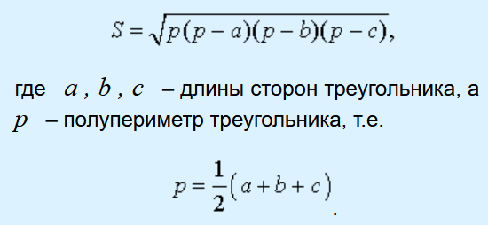

#### Course: Mobile development in C++/Qt QUICK  
#### Lesson 01. Introduction to Qt Quick  

***  

<b>Задачи:</b>  

1. Сделайте [аналогичную](Lesson-01/Source "исходный пример") по анимациям форму входа с использованием QWidgets;  

2. Напишите программу на QML, которая бы вычисляла площадь треугольника по трём сторонам, используя формулу Герона:  

   {: .center}

3. Сделайте версию предыдущей задачи, которая вычисляет площадь по координатам вершин треугольника:  

    

